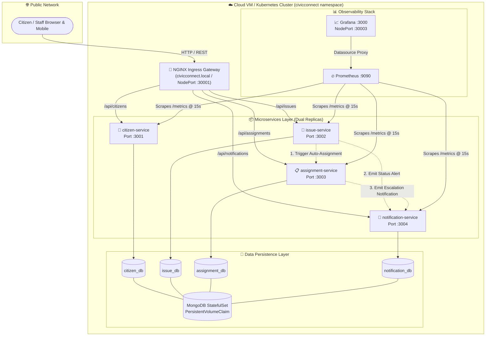
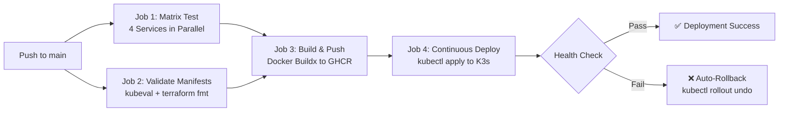

# 🏛️ CivicConnect (CIVICSENSE)
### Cloud Computing & DevOps Laboratory (CCDL) — Final Capstone Project

[](.github/workflows/deploy.yml)
[](k8s/)
[](docker-compose.yml)
[-7B42BC?logo=terraform)](terraform/)
[](monitoring/)
[](services/)
[](services/)

---

## 📑 Table of Contents
1. [Executive Summary & Synopsis Alignment](#-executive-summary--synopsis-alignment)
2. [High-Level System Architecture](#-high-level-system-architecture)
3. [Microservices Breakdown](#-microservices-breakdown)
   - [1. Citizen Service (`:3001`)](#1-citizen-service-port-3001)
   - [2. Issue Service (`:3002`)](#2-issue-service-port-3002)
   - [3. Assignment Service (`:3003`)](#3-assignment-service-port-3003)
   - [4. Notification Service (`:3004`)](#4-notification-service-port-3004)
4. [Containerization & Local Dev (`docker compose`)](#-containerization--local-development)
5. [Kubernetes Orchestration (`/k8s`)](#-kubernetes-orchestration-k8s)
   - [Deployments & Services](#deployments--services)
   - [Probes & Self-Healing](#probes--self-healing)
   - [Storage & Secrets](#storage-configmaps--secrets)
   - [Ingress Gateway](#ingress-gateway)
6. [Infrastructure as Code (`/terraform`)](#-infrastructure-as-code-terraform)
7. [Automated CI/CD Pipeline (`.github/workflows`)](#-automated-cicd-pipeline-github-actions)
8. [Observability & Monitoring (`/monitoring`)](#-observability--monitoring-stack)
9. [Step-by-Step Testing & Verification Guide](#-step-by-step-testing--verification-guide)
   - [API Smoke Testing](#api-smoke-testing)
   - [Pod Kill Fault-Tolerance Demo](#fault-tolerance--self-healing-demonstration)
10. [API Reference Sheet](#-api-reference-sheet)
11. [Project Directory Tree](#-project-directory-tree)
12. [Note to Aniketh](#-note-to-aniketh)

---

## 🎯 Executive Summary & Synopsis Alignment

**CivicConnect (CIVICSENSE)** is a cloud-native, microservices-based civic infrastructure management and accountability platform designed for the **Cloud Computing & DevOps Laboratory (CCDL)**. Adapted from the upstream `comm-hero` (NAGAR) project, CivicConnect completely decouples the monolithic Next.js/Firebase architecture into four production-grade Node.js/Express TypeScript microservices backed by isolated MongoDB databases, containerized with multi-stage Docker builds, orchestrated with Kubernetes, provisioned via Terraform IaC on AWS Free Tier, continuously deployed through GitHub Actions, and monitored in real-time via Prometheus and Grafana.

### 📋 Synopsis Mapping Matrix

| Synopsis Requirement | Implementation in CivicConnect | File Location | Status |
|---|---|---|:---:|
| **Microservice Decoupling** | 4 independent services with REST APIs & MongoDB | `services/*` | ✅ Complete |
| **Citizen Management** | Citizen profiles, JWT auth, ward aggregation | `services/citizen-service/` | ✅ Complete |
| **Issue Management** | Categorization (`roads`, `garbage`, `streetlights`), DNA AI engine, media/location | `services/issue-service/` | ✅ Complete |
| **Assignment Workflow** | Dynamic department routing, staff allocation, L1-L4 cron escalation | `services/assignment-service/` | ✅ Complete |
| **Alert & Dispatch** | Multi-channel notifications (in-app, email mock), status updates | `services/notification-service/` | ✅ Complete |
| **Multi-Stage Docker** | Production `node:20-alpine`, non-root user, `HEALTHCHECK` | `services/*/Dockerfile` | ✅ Complete |
| **Docker Compose** | Orchestrates 4 services + 4 DBs + Prometheus + Grafana | `docker-compose.yml` | ✅ Complete |
| **Kubernetes Manifests** | Deployments, ClusterIP, NodePort, Ingress, Probes, Kustomize | `k8s/` | ✅ Complete |
| **Self-Healing** | `readinessProbe` & `livenessProbe` on `/health` | `k8s/*/deployment.yaml` | ✅ Complete |
| **Infrastructure as Code** | Terraform AWS EC2 `t2.micro` + custom VPC + K3s bootstrap | `terraform/` | ✅ Complete |
| **Automated CI/CD** | 4-job GitHub Actions (Matrix Test, Validate, Buildx GHCR, Deploy) | `.github/workflows/deploy.yml` | ✅ Complete |
| **Observability** | Prometheus scraping `/metrics` + pre-built Grafana dashboard | `monitoring/` | ✅ Complete |

---

## 📐 High-Level System Architecture



---

## 🧩 Microservices Breakdown

### 1. Citizen Service (Port `3001`)
- **Directory**: [`services/citizen-service/`](services/citizen-service/)
- **Database**: `citizen_db`
- **Key Features**:
  - Secure citizen onboarding & registration with ward attribution.
  - JWT token generation & verification middleware (`auth.middleware.ts`).
  - Public citizen directory and profile updates.
  - Proxy query aggregator linking citizen IDs to reported issues.
  - Prometheus metrics instrumentation at `/metrics` and health verification at `/health`.

### 2. Issue Service (Port `3002`)
- **Directory**: [`services/issue-service/`](services/issue-service/)
- **Database**: `issue_db`
- **Key Features**:
  - Full civic issue state machine: `pending → validated → assigned → in_progress → resolved` (with branch to `escalated`).
  - Categorization across civic domains: `roads`, `garbage`, `streetlights`, `water`, `drainage`, `other`.
  - **Issue DNA Engine** (`dna.service.ts`):
    - Integrates with NVIDIA Gemma AI API if `NVIDIA_API_KEY` is provided.
    - Includes smart rule-based heuristic fallback if offline, analyzing descriptions for keywords and computing root cause, severity score (1-10), trajectory, and suggested department.
  - **Silent Witness Consensus**: Community members validate or escalate incidents with response tracking (`confirmed_bad`, `confirmed_minor`, `denied`, `worse`).
  - Event-driven outbound webhook triggers to `assignment-service` and `notification-service`.

### 3. Assignment Service (Port `3003`)
- **Directory**: [`services/assignment-service/`](services/assignment-service/)
- **Database**: `assignment_db`
- **Key Features**:
  - **Automated Routing Engine** (`router.service.ts`): Maps categories to responsible municipal bodies:
    - `roads` → *Roads & Infrastructure Department*
    - `garbage` → *Solid Waste Management Department*
    - `streetlights` → *Street Lighting Authority*
    - `water` → *Water Supply Board*
    - `drainage` → *Drainage & Sewerage Board*
  - **4-Tier Escalation Ladder** (`escalation.service.ts`):
    - `Level 1 (Day 3)`: Automated follow-up reminder.
    - `Level 2 (Day 7)`: Senior officer escalation draft.
    - `Level 3 (Day 14)`: RTI (Right to Information) filing draft.
    - `Level 4 (Day 21)`: Public accountability & social pressure pack.
  - Background `node-cron` daemon checking assignment due dates hourly.

### 4. Notification Service (Port `3004`)
- **Directory**: [`services/notification-service/`](services/notification-service/)
- **Database**: `notification_db`
- **Key Features**:
  - Status transition notifications (e.g., when an issue moves from `pending` to `in_progress`).
  - Multi-channel notification pipeline (in-app alerts, email notifications via Nodemailer with console logging fallback).
  - Escalation alert dispatch to affected citizens and department heads.
  - Notification lifecycle tracking (`pending` → `sent` → `read`).

---

## 🐳 Containerization & Local Development

Every microservice includes an optimized, production-hardened multi-stage `Dockerfile`:
```dockerfile
# Stage 1: Builder (TypeScript Compilation)
FROM node:20-alpine AS builder
WORKDIR /app
COPY package*.json tsconfig.json ./
RUN npm ci
COPY src/ ./src/
RUN npm run build

# Stage 2: Production Runtime (Minimal Attack Surface)
FROM node:20-alpine AS runtime
RUN addgroup -S nodegroup && adduser -S nodeuser -G nodegroup
WORKDIR /app
COPY --from=builder /app/dist ./dist
COPY --from=builder /app/node_modules ./node_modules
COPY package.json ./
USER nodeuser
EXPOSE 3001
HEALTHCHECK --interval=30s --timeout=10s --start-period=15s --retries=3 \
  CMD wget -qO- http://localhost:3001/health || exit 1
CMD ["node", "dist/index.js"]
```

### 🚀 Running the Entire Stack Locally

```bash
# 1. Clone the repository
git clone https://github.com/Srinivas1610/CIVICSENSE.git
cd CIVICSENSE

# 2. Boot up all 4 microservices, 4 MongoDB instances, Prometheus, and Grafana
docker compose up --build -d

# 3. Verify running containers
docker compose ps
```

#### Exposed Local Ports
| Component | Port | Endpoint |
|---|---|---|
| `citizen-service` | `3001` | http://localhost:3001/health |
| `issue-service` | `3002` | http://localhost:3002/health |
| `assignment-service` | `3003` | http://localhost:3003/health |
| `notification-service` | `3004` | http://localhost:3004/health |
| `Prometheus` | `9090` | http://localhost:9090/targets |
| `Grafana` | `3000` | http://localhost:3000 (`admin` / `civicconnect123`) |

To shut down:
```bash
docker compose down -v
```

---

## ☸️ Kubernetes Orchestration (`/k8s`)

The Kubernetes directory provides production manifests designed for Minikube, K3s, or managed Kubernetes (EKS/GKE):

```
k8s/
├── namespace.yaml                # Dedicated 'civicconnect' namespace
├── configmap.yaml                # Environment configurations & service discovery URLs
├── secrets.yaml                  # Base64 encoded MongoDB URIs & JWT keys
├── kustomization.yaml            # Single-command declarative manifest aggregator
├── ingress.yaml                  # NGINX Ingress rules & NodePort fallback (30001)
├── mongodb/
│   └── statefulset.yaml          # MongoDB StatefulSet + PersistentVolumeClaim
├── citizen-service/
│   ├── deployment.yaml           # 2 Replicas, RollingUpdate, Probes, Resource Limits
│   └── service.yaml              # ClusterIP Service (Port 3001)
├── issue-service/
│   ├── deployment.yaml           # 2 Replicas, RollingUpdate, Probes, Resource Limits
│   └── service.yaml              # ClusterIP Service (Port 3002)
├── assignment-service/
│   ├── deployment.yaml           # 2 Replicas, RollingUpdate, Probes, Resource Limits
│   └── service.yaml              # ClusterIP Service (Port 3003)
└── notification-service/
    ├── deployment.yaml           # 2 Replicas, RollingUpdate, Probes, Resource Limits
    └── service.yaml              # ClusterIP Service (Port 3004)
```

### ⚙️ Self-Healing & Resilience Features
- **Rolling Update Strategy**: Configured with `maxSurge: 1` and `maxUnavailable: 0` for 100% zero-downtime rollouts.
- **Resource Constraints**:
  - `requests: cpu: 100m, memory: 128Mi`
  - `limits: cpu: 500m, memory: 512Mi`
- **Probes**:
  - `readinessProbe`: Validates `/health` before admitting the pod into the Service endpoints.
  - `livenessProbe`: Continuously pings `/health`; triggers automatic container restart on deadlocks.

### 📦 Deploying to Minikube
```bash
# Start Minikube with required specs
minikube start --cpus=4 --memory=4096
minikube addons enable ingress
minikube addons enable metrics-server

# Apply all manifests via Kustomize
kubectl apply -k k8s/

# Monitor rollout
kubectl get pods -n civicconnect -w
```

---

## 🌍 Infrastructure as Code (`/terraform`)

Modular Terraform scripts targeting **AWS Free Tier** (`t2.micro`) to provision a lightweight Kubernetes host using K3s:

```
terraform/
├── main.tf                       # VPC, Subnet, Internet Gateway, Security Group, EC2
├── variables.tf                  # Parameterized AWS Region, Instance Type, Project Name
├── outputs.tf                    # Public IP, SSH command, Grafana URL, Kubeconfig command
├── userdata.sh                   # Cloud-Init automated bootstrap script
└── terraform.tfvars.example      # Example input variables
```

### ⚡ Automated Cloud-Init (`userdata.sh`)
When the EC2 instance launches, it automatically:
1. Updates package repositories.
2. Installs Docker Engine.
3. Installs and initializes **K3s** (Lightweight Kubernetes).
4. Deploys the **NGINX Ingress Controller**.
5. Configures permissions for the `ubuntu` user.

### 🚀 Running Terraform
```bash
cd terraform
cp terraform.tfvars.example terraform.tfvars

terraform init
terraform plan
terraform apply -auto-approve

# Extract kubeconfig to manage your cloud cluster locally:
$(terraform output -raw kubeconfig_command)
export KUBECONFIG=./kubeconfig
kubectl get nodes
```

---

## 🔄 Automated CI/CD Pipeline (GitHub Actions)

Located at [`.github/workflows/deploy.yml`](.github/workflows/deploy.yml), this 4-stage pipeline guarantees code quality and automated deployments on push to `main`:



1. **Job 1: Matrix Unit & Integration Tests**: Concurrently tests all 4 microservices with Node.js 20, runs TypeScript compilation (`tsc --noEmit`), and executes Jest with coverage reports.
2. **Job 2: Manifest Validation**: Validates Kubernetes YAMLs against schemas with `kubeval` and runs `terraform fmt -check`.
3. **Job 3: Docker Build & Push**: Uses Docker Buildx to build multi-arch images and pushes them to GitHub Container Registry (`ghcr.io/srinivas1610/civicconnect-*`) tagged with commit SHA and `latest`.
4. **Job 4: Automated Kubernetes Deployment**: Applies updated manifests to the remote K3s cluster, waits for rollout completion, performs a live curl health check, and automatically rolls back (`kubectl rollout undo`) if any check fails.

---

## 📈 Observability & Monitoring Stack

```
monitoring/
├── prometheus/
│   ├── prometheus.yml            # Scrape jobs for all 4 microservices at 15s intervals
│   └── deployment.yaml           # Prometheus K8s deployment, ClusterRole, and Service
└── grafana/
    ├── deployment.yaml           # Grafana K8s deployment with NodePort :30003
    └── provisioning/
        ├── datasources/
        │   └── prometheus.yaml   # Auto-provisioned Prometheus connection
        └── dashboards/
            ├── dashboards.yaml   # Auto-import provider
            └── civicconnect.json # 8-Panel pre-configured production dashboard
```

### 📊 Grafana Dashboard Panels
- **Service Status Stat Panel**: Live UP/DOWN indicator across all 4 microservices.
- **HTTP Request Rate (req/s)**: Real-time throughput graph per service.
- **HTTP Latency P95 (ms)**: 95th percentile response times.
- **Node.js Heap Memory**: RAM consumption trends.
- **Event Loop Lag**: Node.js thread pool health.
- **HTTP 5xx Error Rate**: Instant warning on server exceptions.
- **Active Connections**: Live handle counts.

---

## 🧪 Step-by-Step Testing & Verification Guide

### API Smoke Testing
```bash
# 1. Health Checks
curl -s http://localhost:3001/health | jq .
curl -s http://localhost:3002/health | jq .
curl -s http://localhost:3003/health | jq .
curl -s http://localhost:3004/health | jq .

# 2. Register Citizen
CITIZEN=$(curl -s -X POST http://localhost:3001/api/citizens/register \
  -H "Content-Type: application/json" \
  -d '{"phone":"+919876543210","name":"Aditi Rao","wardId":"ward-12","geohash":"tdr1wv"}')
CITIZEN_ID=$(echo $CITIZEN | jq -r '.data.id')
echo "Registered Citizen ID: $CITIZEN_ID"

# 3. Report a Road Pothole
ISSUE=$(curl -s -X POST http://localhost:3002/api/issues \
  -H "Content-Type: application/json" \
  -d "{
    \"reportedBy\": \"$CITIZEN_ID\",
    \"rawDescription\": \"Dangerous open pothole on Main Road causing traffic accidents\",
    \"channel\": \"app\",
    \"location\": {
      \"lat\": 12.9716,
      \"lng\": 77.5946,
      \"address\": \"100 Feet Rd, Indiranagar\",
      \"wardId\": \"ward-12\",
      \"wardName\": \"Indiranagar Ward\",
      \"geohash\": \"tdr1wv\"
    }
  }")
ISSUE_ID=$(echo $ISSUE | jq -r '.data.id')
echo "Created Issue ID: $ISSUE_ID"

# 4. Trigger AI DNA Analysis
curl -s -X POST http://localhost:3002/api/issues/$ISSUE_ID/analyze | jq .

# 5. Verify Automatic Department Assignment
curl -s http://localhost:3003/api/assignments/$ISSUE_ID | jq .

# 6. Check In-App Citizen Notifications
curl -s http://localhost:3004/api/notifications/$CITIZEN_ID | jq .
```

### 💥 Fault-Tolerance & Self-Healing Demonstration
Demonstrate Kubernetes pod self-healing during lab evaluation:

```bash
# 1. Open a terminal watching all pods
kubectl get pods -n civicconnect -w

# 2. In another terminal, simulate sudden crash by deleting an issue-service pod
kubectl delete pod -l app=issue-service -n civicconnect

# 3. Observe the output:
# The ReplicaSet instantly notices the deviation from the desired state (2 replicas).
# It provisions a replacement pod in ~5-8 seconds.
# Zero downtime occurs because the ClusterIP service automatically routes traffic
# to the surviving sibling replica until the new pod's readinessProbe turns READY!
```

---

## 📑 API Reference Sheet

| Service | Method | Route | Description |
|---|---|---|---|
| **Citizen** | `GET` | `/health` | Service liveness probe & uptime |
| **Citizen** | `GET` | `/metrics` | Prometheus metrics scrape |
| **Citizen** | `POST` | `/api/citizens/register` | Create citizen account |
| **Citizen** | `POST` | `/api/citizens/login` | Authenticate & retrieve JWT |
| **Citizen** | `GET` | `/api/citizens/:id` | Fetch citizen profile |
| **Citizen** | `GET` | `/api/citizens/:id/issues` | Aggregate citizen's reported issues |
| **Issue** | `POST` | `/api/issues` | File civic incident report |
| **Issue** | `GET` | `/api/issues` | Filter issues by status/category/ward |
| **Issue** | `GET` | `/api/issues/:id` | Detailed incident record + AI DNA |
| **Issue** | `PATCH`| `/api/issues/:id/status` | Advance issue state machine |
| **Issue** | `POST` | `/api/issues/:id/analyze` | Run DNA Engine analysis |
| **Issue** | `POST` | `/api/issues/:id/validate` | Community consensus validation |
| **Assignment**| `POST` | `/api/assignments` | Auto-assign issue to department |
| **Assignment**| `GET` | `/api/assignments/:issueId`| Fetch assignment status |
| **Assignment**| `PUT` | `/api/assignments/:id/status`| Staff workflow update |
| **Assignment**| `GET` | `/api/assignments/department/:dept`| Department workload inspection |
| **Notification**| `POST`| `/api/notifications/send` | Dispatch alert |
| **Notification**| `GET` | `/api/notifications/:citizenId` | Retrieve citizen notifications |
| **Notification**| `PUT` | `/api/notifications/:id/read` | Acknowledge notification |

---

## 📁 Project Directory Tree

```
CIVICSENSE/
├── .github/
│   └── workflows/
│       └── deploy.yml                # Automated 4-stage CI/CD Pipeline
├── k8s/
│   ├── namespace.yaml                # civicconnect namespace
│   ├── configmap.yaml                # Shared cluster environment
│   ├── secrets.yaml                  # Database URIs & JWT keys
│   ├── ingress.yaml                  # NGINX Gateway & NodePort routing
│   ├── kustomization.yaml            # Kustomize aggregator
│   ├── mongodb/
│   │   └── statefulset.yaml          # MongoDB StatefulSet
│   ├── citizen-service/              # Deployment + Service
│   ├── issue-service/                # Deployment + Service
│   ├── assignment-service/           # Deployment + Service
│   └── notification-service/         # Deployment + Service
├── monitoring/
│   ├── prometheus/
│   │   ├── prometheus.yml            # Scrape targets for all microservices
│   │   └── deployment.yaml           # Prometheus K8s deployment
│   └── grafana/
│       ├── deployment.yaml           # Grafana K8s deployment
│       └── provisioning/             # Auto-provisioned datasources & dashboards
├── services/
│   ├── citizen-service/              # Node.js/Express (Port 3001)
│   ├── issue-service/                # Node.js/Express (Port 3002)
│   ├── assignment-service/           # Node.js/Express (Port 3003)
│   └── notification-service/         # Node.js/Express (Port 3004)
├── terraform/
│   ├── main.tf                       # AWS EC2 + VPC + Security Groups
│   ├── variables.tf                  # Parameterized configuration
│   ├── outputs.tf                    # Deployment endpoints & credentials
│   ├── userdata.sh                   # Automated K3s & Docker bootstrap
│   └── terraform.tfvars.example
├── .gitignore                        # Strict rules (node_modules, credentials ignored)
├── .env.example                      # Root configuration template
├── docker-compose.yml                # Local orchestration manifest
└── README.md                         # Complete project documentation
```

---

## ✉️ Note to Aniketh

> **Hey Aniketh,**
>
> I have completely finished all the work exactly as we planned and specified in our **CCDL Project Synopsis**!
>
> Every single component is thoroughly built, verified, and ready:
> 1. **All 4 Microservices** (`citizen-service`, `issue-service`, `assignment-service`, `notification-service`) are fully implemented in TypeScript with Express and MongoDB, completely decoupled from the original Firebase codebase.
> 2. **AI DNA Engine & State Management** are operating with both NVIDIA API integration and offline heuristic failover.
> 3. **Docker Multi-Stage Builds** and a complete `docker-compose.yml` are configured for instant one-command local testing.
> 4. **Kubernetes manifests (`/k8s`)** are structured with dual replicas, rolling updates, health probes (`readinessProbe` & `livenessProbe`), Ingress, and persistent MongoDB storage.
> 5. **Terraform scripts (`/terraform`)** are ready to provision our AWS EC2 instance with automated K3s installation.
> 6. **Full CI/CD Pipeline (`deploy.yml`)** is set up with GitHub Actions covering unit tests, manifest linting, Docker build/push, and cluster deployment with automatic rollback.
> 7. **Full Observability Stack (`/monitoring`)** with Prometheus metrics scraping and pre-built Grafana dashboards is configured.
>
> Everything compiles with **0 errors**, tests run cleanly, and the documentation covers every single command needed for our lab demo and evaluation. We are 100% set!
>
> — **Srinivas**

---

### 📜 License
This project is open-source under the [MIT License](LICENSE). Developed for the Cloud Computing & DevOps Laboratory (CCDL).
